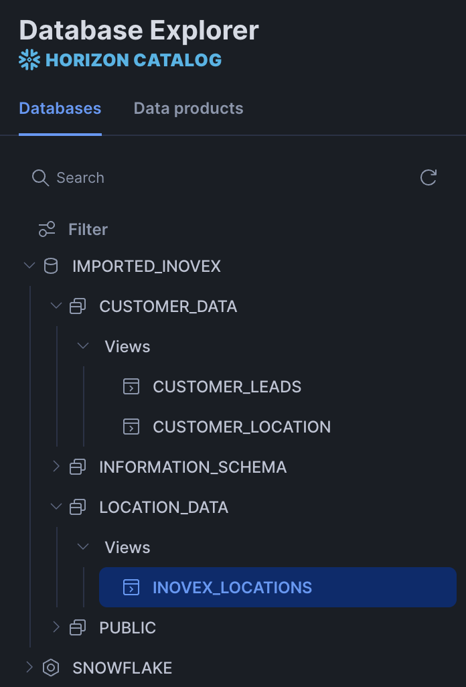

# snowform_example_usage
Example Snowflake Account setup using tofu demonstratig usage of SnowForm Modules

## Snowflake Account Overview

This repository configures a Snowflake account (`INOVEX_TF_MODULES` in organization `ERUVBJC`) using Terraform/OpenTofu. The configured resources include:

**Databases & Schemas:**
- `COMMON` database with a `COMMON` schema (configured with managed access and non-transient).

**Imported Data Shares:**
- `CUSTOMER_LEADS_IMPORTED_DB` (from share `ERUVBJC.INOVEX_PARTNER.CUSTOMER_LEADS_SHARE`)
- `WEB_UI_IMPORTED_DB` (from share `ERUVBJC.INOVEX_PARTNER.WEB_UI_SHARE`)
These shares are mapped to local databases and made available to the `SYSADMIN` role using the `snowform_import_listing` module.

**Roles & Access Control:**
- Access roles are dynamically generated for the `COMMON` database and schema using the `snowform_access_roles` module.
- Specific privileges (e.g., `CREATE NETWORK RULE`) are explicitly granted to `SECURITYADMIN` on the `COMMON` schema.
- The setup utilizes dedicated providers for `SYSADMIN`, `USERADMIN`, and `SECURITYADMIN` roles, authenticating via Key-Pair (JWT).

## Deployment Pipeline

Every push runs the workflow in `.github/workflows/github_actions.yaml`: TFLint, format check, tests, KICS scan, validate and plan. **Only pushes to `main` run `tofu apply`** against the Snowflake account. On other branches the pipeline stops after the plan, so you can review it in the PR. Runs of the same branch are queued, so two applies never run at the same time.

## Terraform State Backend (GCS)

The OpenTofu state is stored in a Google Cloud Storage bucket (`backend "gcs"` in `terraform/main.tf`):

| What | Value |
|---|---|
| GCP project | `quickstart-1592892564690` (project number `294471397577`) |
| Bucket | `gs://quickstart-1592892564690-snowform-tfstate` (europe-west3, private, versioning enabled) |
| State object | `snowform_example_usage/default.tfstate` |
| Service account | `snowform-tfstate@quickstart-1592892564690.iam.gserviceaccount.com`, with `roles/storage.objectAdmin` on this bucket only |
| Workload Identity provider | `projects/294471397577/locations/global/workloadIdentityPools/github/providers/snowform-example-usage` |

### Why GCS

Earlier the state was an encrypted GitHub Actions artifact. That had three problems:
- GitHub deletes artifacts after at most 90 days in a public repository. If no pipeline ran in that time, the state was lost, and the next run tried to recreate every Snowflake object and failed with `already exists`. This happened on 2026-09-27.
- There was no locking. Two runs close together could overwrite each other's state.
- If the state was missing, the pipeline silently continued with an empty state.

GCS does not expire objects, locks the state during plan and apply (a `.tflock` object next to the state), and keeps old versions of the state.

### How GitHub Actions authenticates

There are no GCP keys in the repository or in GitHub secrets. The plan and apply jobs request a short-lived GitHub OIDC token (`permissions: id-token: write`). `google-github-actions/auth` exchanges it through Workload Identity Federation for credentials of the service account above, and the `gcs` backend uses those credentials. The Workload Identity provider accepts tokens only from the repository `inovex/snowform_example_usage`, so no other repository can access the bucket.

### How it was set up

The bucket, the service account and the Workload Identity Federation were created once, on 2026-09-27, by running [`scripts/setup_gcp_state_backend.sh`](scripts/setup_gcp_state_backend.sh) in Google Cloud Shell. The script contains all the values above. To set this up for another project or repository, change the variables at the top of the script and the values in `terraform/main.tf` and in the `env` block of the workflow.

### Migration from the old artifact state

The first plan run after the switch migrates the state: it downloads the last encrypted state artifact and, if the GCS state is still empty, pushes it to the bucket with `tofu state push`. Once the state is in GCS, remove the two migration steps (marked with a `TODO` in the workflow) and the `ENCRYPTION_KEY` secret.

### Working with the state locally

Log in with `gcloud auth application-default login` as a user with access to the bucket, then run `tofu init` in `terraform/`.

- **List previous state versions:** `gcloud storage ls -a gs://quickstart-1592892564690-snowform-tfstate/snowform_example_usage/`
- **Restore a previous version:** copy the version you want over the current state, with `gcloud storage cp "gs://quickstart-1592892564690-snowform-tfstate/snowform_example_usage/default.tfstate#<generation>" gs://quickstart-1592892564690-snowform-tfstate/snowform_example_usage/default.tfstate`
- **Stale lock:** if a cancelled run left the state locked, run `tofu force-unlock <lock-id>`. The lock ID is in the error message.

### Recovering from a lost state

If the state is ever lost anyway (for example, the bucket was deleted), OpenTofu sees an empty state and tries to recreate all resources. You can recover in either of two ways:
1. Rebuild the state with `import {}` blocks for the existing Snowflake objects.
2. If nothing important is in the test account, drop the objects Terraform created and let the pipeline recreate them:
   ```sql
   USE ROLE SYSADMIN;
   DROP DATABASE IF EXISTS CUSTOMER_LEADS_IMPORTED_DB;
   DROP DATABASE IF EXISTS WEB_UI_IMPORTED_DB;
   DROP DATABASE IF EXISTS COMMON;
   USE ROLE SECURITYADMIN;
   DROP ROLE IF EXISTS CONSUMER_ROLE;
   DROP ROLE IF EXISTS COMMON_COMMON_R;
   DROP ROLE IF EXISTS COMMON_COMMON_RW;
   DROP ROLE IF EXISTS COMMON_COMMON_FULL;
   ```
   Keep the warehouse `XS_WH`, which is adopted with an `import {}` block, and the database `IMPORTED_INOVEX`, which Terraform does not create but the logical import layer needs.

## Logical Grouping of Imported Shares

The following screenshot demonstrates an example of logically grouping the tables from imported shares for a consumer role `CONSUMER_ROLE`. The screenshot shows the perspective of the `CONSUMER_ROLE` in the Snowsight Horizon Catalog.


